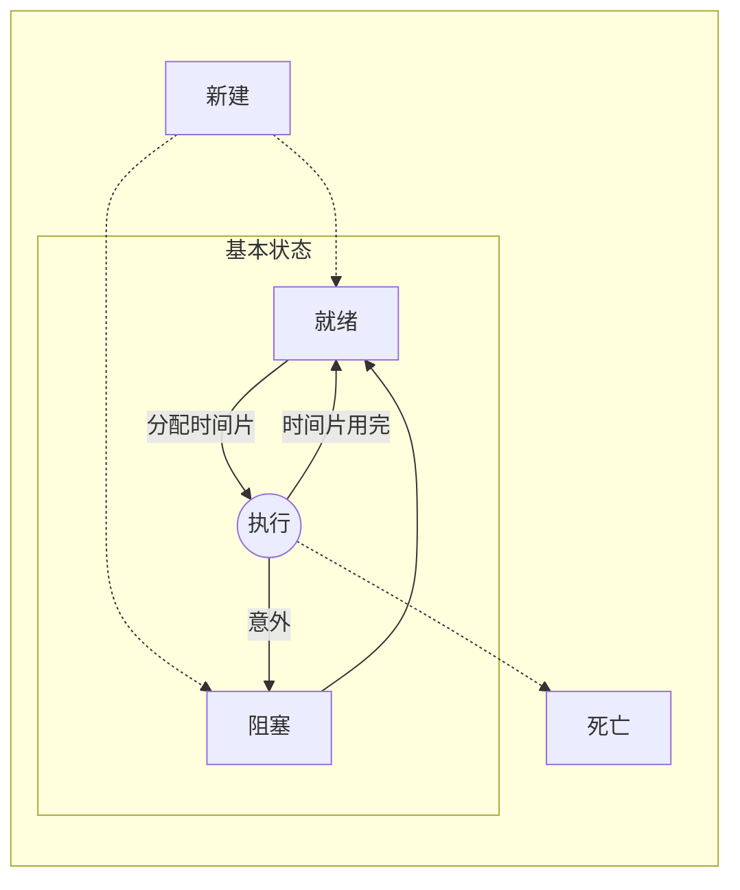

## 并发-进阶内容2
> 上一份了解==多任务资源共享==有关问题
>
> 本节讨论==终结任务==的问题


## 一、awaitTermination

我们知道，线程中的run()方法区运行晚就意味着线程的结束。通过`ExecutorService.awaittermination(时间大小，时间单位)` 可以知道当前线程池内的线程是否都运行完run而结束


## 二、线程的状态



- ==新建(new)==：线程创建时，短暂地处于这种状态
- ==就绪(runnable)==：此时的线程只要获得时间片便可运行
- ==阻塞(Blocked)==：线程能够运行但是被某个条件阻止，必须进入就绪状态才可再执行
- ==死亡(Dead)==：处于死亡状态便不可再被调度，不可能复活。一般是run运行完，但也可能是被中断

---

###  Java中线程进入阻塞状态的原因：

1. 调用了`sleep(milliseconds)`
2. 调用了`wait`
3. 等待输入/输出完成
4. 试图获取某个锁，但是锁已被其他线程占用

----

现在你只有一个目的：**能够终止处于阻塞状态的任务**


## 三、中断

### 1. 中断的手段：

- Thread#`interrupt()`方法
- Thread#`interrupted()`方法
- ExecutorService#`shutdown()`
- ExecutorService#`shutdownNow()`
- ExecutorService#submit()->Future#`cancel()`

### 2. 真的能中断吗：

​	通过下面的程序可以发现：中断操作是不能中断==io阻塞==和==同步锁阻塞==的，只能中断==sleep阻塞==

```java
/**
 * 尝试中断三种不同原因阻塞的线程，查看是否能中断成功
 * @author ChenMingYang
 * @date 2021-12-14 14:34
 */
public class Interrupting {
    private static ExecutorService exec = Executors.newCachedThreadPool();

    /**
     * 使用cancel()测试单个Runnable
     * @param runnable
     * @throws InterruptedException
     */
    static void test(Runnable runnable) throws InterruptedException {
        Future<?> f = exec.submit(runnable); //让线程任务开始执行

        TimeUnit.MILLISECONDS.sleep(100);

        String full = runnable.getClass().getName();
        String name = full.substring(full.lastIndexOf(".")+1);

        System.out.println("[开始中断]\t" + name);

        f.cancel(true);//进行中断

        System.out.println("[中断信号已发送给]\t"+ name+"\n");
    }

    public static void main(String[] args) throws InterruptedException {
        test(new SleepBlocked());
        test(new IOBlocked(System.in));
        test(new SynchronizedBlocked());

        TimeUnit.SECONDS.sleep(3);
        System.out.println("\n系统结束");
        System.exit(0);
    }
/** 输出：
 * [开始中断]	SleepBlocked
 * 		如果被中断，应该打出这句：捕获中断异常
 * 		退出 -> SleepBlocked.run()
 * [中断信号已发送给]	SleepBlocked
 * 		IO等待read：
 * [开始中断]	IOBlocked
 * [中断信号已发送给]	IOBlocked
 * 		尝试获取调用f()
 * [开始中断]	SynchronizedBlocked
 * [中断信号已发送给]	SynchronizedBlocked
 *
 * 系统结束
 */
}

/**
 * 睡眠阻塞
 */
class SleepBlocked implements Runnable {
    @Override
    public void run() {
        try {
            TimeUnit.SECONDS.sleep(100);
        } catch (InterruptedException e) {
            System.out.println("\t\t如果被中断，应该打出这句：捕获中断异常");
        }
        System.out.println("\t\t退出 -> SleepBlocked.run()");
    }
}

/**
 * IO阻塞
 */
class IOBlocked implements Runnable {
    private InputStream in;

    public IOBlocked(InputStream in) {
        this.in = in;
    }

    @Override
    public void run() {
        try {
            System.out.println("\t\tIO等待read：");
            in.read();
        } catch (IOException e) {
            if (Thread.currentThread().isInterrupted()) {
                System.out.println("\t\t如果被中断，应该打出这句：IO阻塞中进行中断");
            } else {
                throw new RuntimeException(e);
            }
        }
        System.out.println("\t\t退出 -> IOBlocked.run()");
    }
}

/**
 * 同步阻塞
 */
class SynchronizedBlocked implements Runnable {
    public SynchronizedBlocked() {
        new Thread() {
            @Override
            public void run() {
                f();
            }
        }.start();
    }

    public synchronized void f() {
        while (true) {
            Thread.yield();
        }
    }

    @Override
    public void run() {
        System.out.println("\t\t尝试获取调用f()");
        f();
        System.out.println("\t\t退出 -> synchronizedBlocked.run()");
    }
}

```

### 3. 还有办法吗：

> 还有一个比较笨拙的办法：**关闭任务在其上发生阻塞的底层资源**

```java

```

